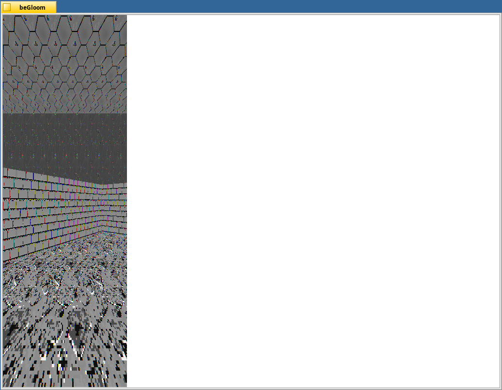

# Gloom3D
Gloom3D is the port of Boom3D for Haiku.

Building
--------

Simply go into Gloom3D directory and type ``make``.

Copyright
------------

Original 2000 version by Sasha Chukov, enhanced and updated for Haiku in 2018 by Arnav Bhatt.
